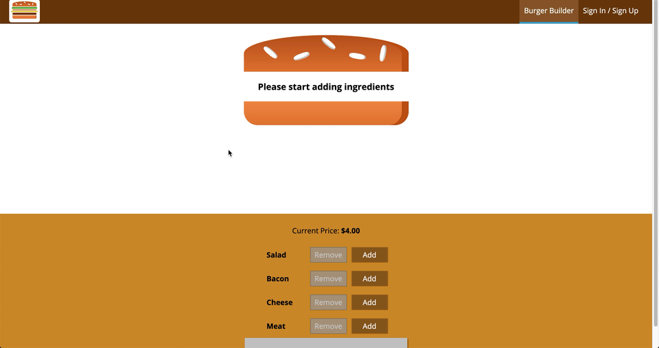

# Burger Builder

Burger builder is a simpe SPA built using React mainly. It allows you to build a customized burger and simulates a real "checkout" process. It is deployed on [Firebase](https://my-burger-builder-57e53.web.app/)

## App Preview

Step 1: Build your burger!

## 

---

Step 2: Checkout your burger!

## 

---

## Stack/technologies used

- React
- Redux
- Firebase for deployment

## Dependencies

- React
- Redux
- Redux thunk
- Axios

## Setup

You can directly visit the deployed app at: https://my-burger-builder-57e53.web.app/. However, if you would like to try it locally first, please follow these steps:

1. Clone git the repository
2. Install dependencies with `npm install`
3. Run app with `npm start`
